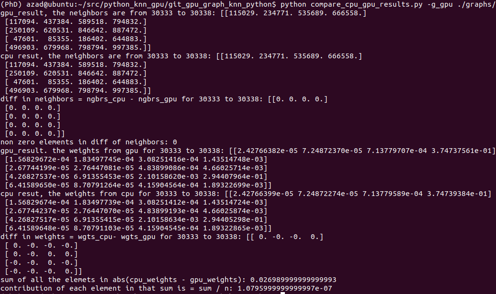

# Weighted_Graph_Python_GPU
A python project to create a weighted graph on gpu using knn. First the neighbors are selected using the geometrical distance then the weights are imparted using the texture on the points. This is project is particularly relevant for graph creation on massive point clouds. 

# Usage
``` shell
$ python generate_data.py -f 1    #this generates random X.npz (position) and Y.npz (texture) data in /data/ folder of one million in size.
$ python graph_gpu.py -p ./data/X.npz -t ./data/Y.npz -k 4    #to create the gpu graph in the /graphs/ folder
$ python graph_cpu.py -p ./data/X.npz -t ./data/Y.npz -k 4  # to create the cpu graph
$ python compare_cpu_gpu_results.py -g_gpu ./graphs/graph_gpu.npz  -g_cpu ./graphs/graph_cpu.npz -k 4 # to ckeck if gpu results match with cpu
```
- **-k**: is the number of nearest neighbors
- **-f**: the value of f other than 1 is to generate the data in .ply format

## Requirments
python3, scipy, numpy, open3d, pyopencl and bufferkdtree

## Results
|   | python gpu |     python cpu     | pdegraphsip |
|:-----------:|:-------:|:----------------:|:----------------:|
| Time taken         | 1.28 seconds    |       263.86 seconds       |   20 seconds       |

This is when executed the same commands as above (one million points in point cloud), the gpu used is nvidia gtx 1080 ti. The processor is i7-3.2gh, ram 16gb.
A screen shot to check the output of the cpu and gpu are indeed very very close. Observe that no errors in the neigbors and very small difference in the weights computed on cpu and gpu.

